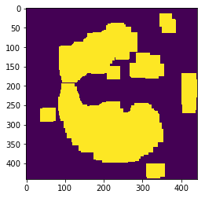
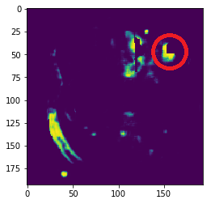

# TianChi Lung Nodules Detection


## Running

First, download data from [TianChi Lung Nodules Detection](https://tianchi.aliyun.com/competition/information.htm?spm=5176.100067.5678.2.4c5fd3bfI4VSS&raceId=231601), and unzip the train/val/test data into ```/train```,```/val```,```/test```.

Preprocess data.

	cd preprocess
	python data_generator.py

Generating data for segmentation.

	cd preprocess
	python generate_seg3d_data.py

Train the segmentation model

	python train_seg.py

Test the segmentation model on validatation data and select candidate

	python validate_stage1.py

Generating data for False Positive Remove.

	cd preprocess
	python generate_classify_v1.py

Train the False Positive Remove Model.
	
	python train_2d.py

Generate the result
	
	python 2d_test.py


## Data Preprocess
There is an example of CT data preprocess in [Kaggle Data Science Bowl 2017 Tutorial](https://www.kaggle.com/c/data-science-bowl-2017#tutorial). However, we found that the lung segmentation in the tutorial is not perfect. Sometimes the minor flaw make the lung nodules masked. We believe that CNN is capable of learning features from raw data, so we simply choose a window as preprocessing.

The code is shown below. 

	def norm(image,window=700):
		image=image+600+window/2
		image[image > window]=window
		image[image < 0]=0;
		image=image.astype(float)
		image=image*255/window
		image=image.astype(np.uint8)
		return image

## Segmentation 

### Weight 
Since the data of CT is not balanced. The volume of lung nodules may be only 1/10000 of the lung. This means the number of positive samples is much less than that of negtive samples. So we should retune the weight of samples.

First, considering that the diameter of nodules in the annotation is not precise, we give the dots far from the center of nodules lower weight. For such label is not credible.

Besides, large nodules could have a diameter of more than 30mm, while the diameter of small nodules is only 3mm. This means the total weight of small nodules is much smaller than that of large nodules, and this may cause small nodules misclassified. So we add weight decay to those nodules which have a diameter of more than 10mm. We don't add completely weight decay to make every nodule have an identical weight(this is more reasonable), because we find it is difficult to train.

However, we still find that about more than 60% missed nodules in segmentation are small nodules（<10mm）.

The code is in ```train_seg.py```.
### NoPad Model
Since we choose 3d model, it's impossible to  train the model on original images with a large batch size. The memory is limited. But a large batch size is essential for batchnorm. So we choose to train the model on image patches. To guarantee that the model trained on patches works fine on original image, we choose not to use padding in CNN.

The lung nodules vary in diameter. So the segmentation methods should be scale invariant. We tried the architecture of Pyramid Scene Parsing Network. But we did not get a good result.

The final model of segmentation is ```models/resnet.py```
### Boosting 
Boosting is a good way to tackle with the unbalanced data. Besides, our goal of segmentation is to get higher recall with less false positive. However, the loss of segmentation is designed to optimize mean accuracy. Boosting can be used to bridging our real goal and the segmentation loss.

The detail of boosting is in ```train_seg.py```.

### Use lung mask to remove part of false negtive 
We used the lung segmentation in [Kaggle Data Science Bowl 2017 Tutorial](https://www.kaggle.com/c/data-science-bowl-2017#tutorial). Lung mask can be used to remove part of false negtive in the segmentation stage. But it may also leads to multi nodules clustered in red circle. We did not use this in the end.




### Segmentation Training
We pretrain the model in a small dataset at first.

	python train_seg.py --num_negtive 0

Then we finetune the model in a large dataset.

	python train_seg.py --num_negtive 10 --pretrain xxx

However, it's still slow.

## Classification(False Positive Remove)
We only tried 2d model, for the time is limited. Only shift augmentation is appied. 